# Yogimazzi

## 🗂 프로젝트 정보

- **프로젝트명**: 여기 맞지? (yogimazzi)
- **진행 기간**: 2025.02.04 ~ 2025.02.21
- **팀원**
    - 송준환, 강요한, 박민준, 이정훈, 이지은

## ✨ 서비스 개요

### 🎯목표

- 카카오 지도 API를 활용한 주소 데이터 정제 및 관리 API 구축
- 구주소 → 신주소 자동 변환으로 데이터 정합성 확보
- 사용자 편의성 향상을 위한 API 서비스 제공
- 권한 분리 및 보안 기능 강화
- 성능 개선 및 트래픽 대응 시스템 설계

### 🏅주요 성과

- **신/구주소 자동 변환**으로 데이터 정합성 및 신뢰도 확보
- **히스토리 관리 기반 주소 이력 추적 기능** 구현
- RESTful API 완성 및 배포 자동화 적용 (CI/CD)

### 🗃️ 사용 기술 스택

- **Backend:** Java 21, Spring Boot, Spring Security, JPA, PostgreSQL
- **Frontend:** React.js
- **Infra:** AWS (EC2, RDS, S3, ALB, Route53), Docker, GitHub Actions
- **ETC:** Kafka, Redis, Swagger, Jenkins, Elasticsearch

## 🧑‍💻 나의 역할

<strong>Kakao API 기반 주소 처리 기능 구현</strong>

**기술 스택**: Java, Spring Boot, Kakao Maps API, JPA

**구현 내용**:

- 유저 생성 시 입력 주소를 Kakao API를 통해 위도/경도 및 지번·도로명 주소로 변환
- 응답 데이터는 `ObjectMapper`로 파싱하여 DTO(`KakaoApiAddressResponse`)로 매핑
- 기존 주소가 있으면 재사용, 없을 경우만 새 Address 객체 생성
- API 호출 실패 시 사용자 정의 예외 처리
- 도메인 계층 리팩토링 및 모듈 분리

**⚠️ 주요 이슈**

- 주소 중복 저장 → 동일 주소 식별 후 재활용
- 외부 API 실패 시 전체 흐름 중단 방지 → 커스텀 예외 및 fallback 처리

<strong>시스템 모니터링 구축</strong>

**기술 스택**: Prometheus, Grafana, Spring Actuator

**구현 내용**:

- 어플리케이션 및 서버 상태 모니터링 대시보드 구축
- 네트워킹 세션, 테이블 사용률 등 커스텀 메트릭 수집 및 시각화

**⚠️ 주요 이슈**

- 운영 중인 기능별 상태를 실시간으로 확인할 방법
→ Prometheus Exporter + Grafana 대시보드로 실시간 모니터링 가능

<strong>ERD 설계 및 데이터 정규화</strong>

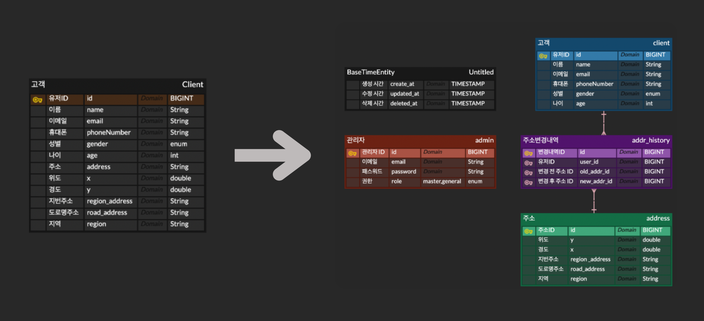

<strong>ERD 설계 문서</strong>

# 📘 ERD 설계 문서

## 📌 프로젝트 ERD 설명

본 프로젝트의 ERD는 **사용자, 주소, 관리자, 주소 변경 이력** 등 주요 도메인을 중심으로  
고객 정보와 주소 데이터를 **효율적으로 관리**하기 위한 데이터베이스 설계를 기반으로 합니다.

---

## 📂 테이블 요약

### 🕒 0. 공유 테이블 – `BaseTimeEntity`

> 모든 테이블에 공통적으로 포함되는 시간 정보 컬럼입니다.

| 컬럼명      | 설명       |
|-------------|------------|
| `created_at` | 생성 시간 |
| `updated_at` | 수정 시간 |
| `deleted_at` | 삭제 시간 |

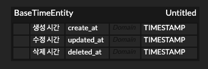

---

### 👤 1. 관리자 테이블 – `Admin`

> 관리자 계정을 저장하고 역할을 구분합니다.

| 컬럼명     | 설명           |
|------------|----------------|
| `email`    | 관리자 이메일  |
| `password` | 비밀번호       |
| `role`     | 관리자 권한 (`SUPER` / `NORMAL`) |

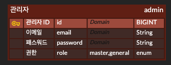

---

### 🙍‍♂️ 2. 고객 테이블 – `User`

> 고객 정보를 저장하는 테이블입니다.

| 컬럼명       | 설명               |
|--------------|--------------------|
| `id`         | 고객 고유 ID (PK)  |
| `email`      | 이메일              |
| `phoneNumber`| 연락처             |
| `gender`     | 성별               |
| `age`        | 나이               |

> ✅ 중복 필드(`gender`, `age`)는 제거 또는 정리 필요

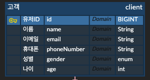

---

### 🗺️ 3. 주소 테이블 – `Address`

> 고객의 주소를 분리하여 저장하며, 위도/경도 정보도 포함됩니다.

| 컬럼명           | 설명             |
|------------------|------------------|
| `id`             | 주소 ID (PK)     |
| `x`              | 경도             |
| `y`              | 위도             |
| `region_address` | 지번 주소        |
| `road_address`   | 도로명 주소      |
| `region`         | 지역 구분        |

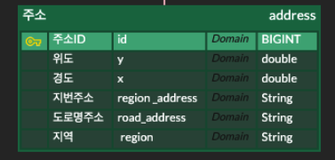

---

### 🔁 4. 주소 변경 이력 테이블 – `AddressHistory`

> 고객이 주소를 변경할 때마다 그 이력을 저장합니다.

| 컬럼명        | 설명                    |
|---------------|-------------------------|
| `id`          | 변경내역 ID (PK)        |
| `user_id`     | 고객 ID (FK)            |
| `old_addr_id` | 이전 주소 ID (FK)       |
| `new_addr_id` | 변경된 주소 ID (FK)     |

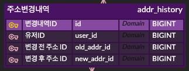

---

## 🧩 전체 ERD 구성

> ERD 다이어그램으로 전체 테이블 관계를 시각화한 이미지입니다.

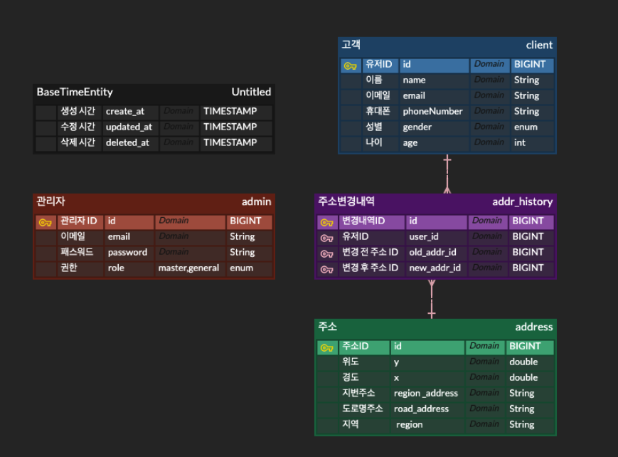

---

## ✅ 요약

- **정규화 원칙**에 따라 주소를 별도 테이블로 분리하여 중복을 최소화하고, 변경 이력을 관리할 수 있도록 설계하였습니다.
- 데이터 무결성과 확장성, 성능을 고려한 **관계형 데이터베이스 모델링**을 적용하였습니다.

---

[ERD 설계 문서](https://www.notion.so/ERD-242172cf6ea180d5a46bfe0acfe54fb8?pvs=21)

[데이터 정규화 보고서](https://www.notion.so/242172cf6ea180ef88d3d2b954ab5582?pvs=21)

## 💻시스템 아키텍처
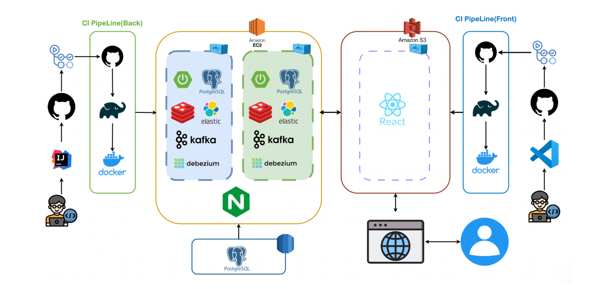

## 💭 유스케이스

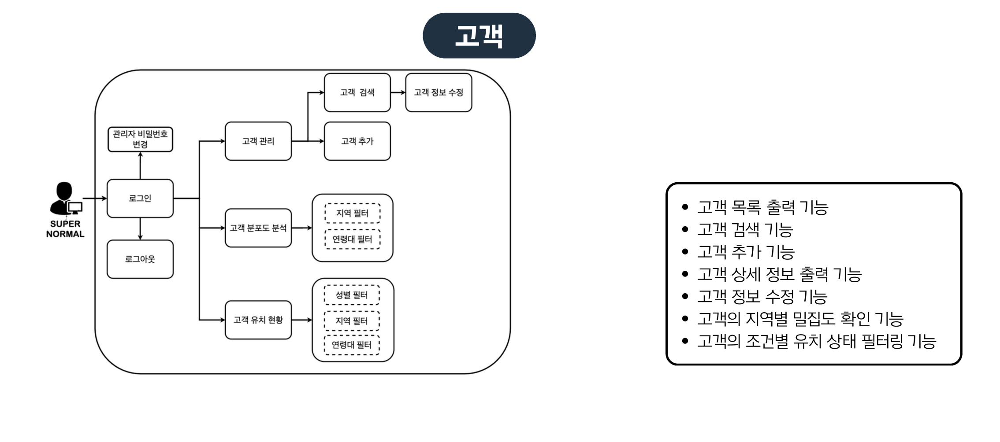

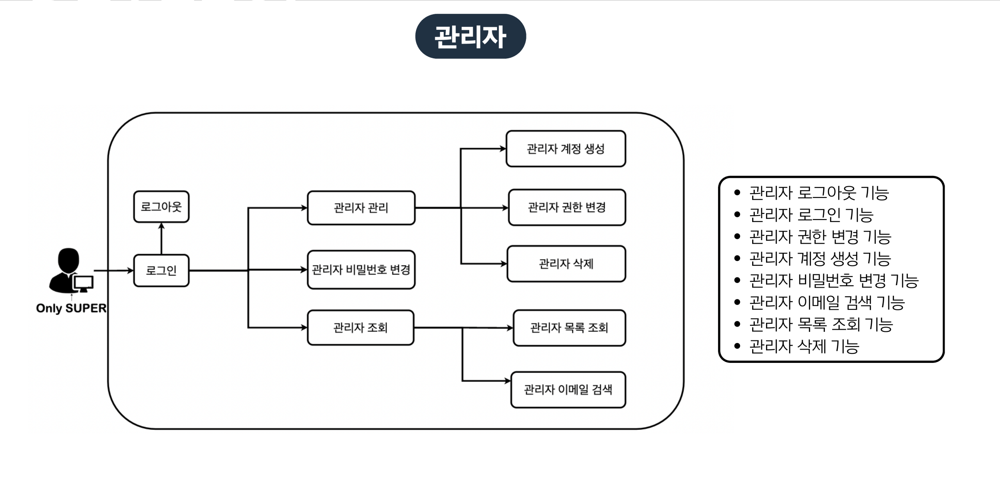

## 🎬 주요 기능별 데모

## 관리자 관련 기능

<strong>관리자 추가</strong>

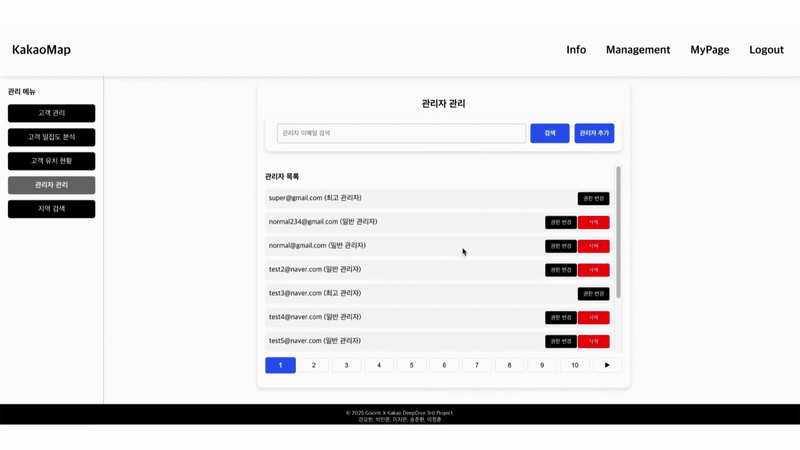

- 이메일,패스워드를 입력 받아 계정생성

<strong>로그인</strong>

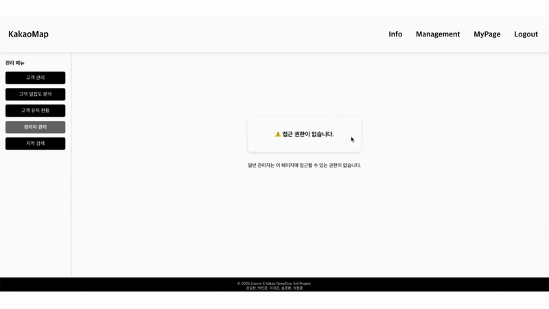

- JWT 기반 인증 인가 구현
- 토큰 재발급 API를 통해 레디스에 저장된 토큰을 확인해  토큰 재발급

<strong>비밀번호 변경</strong>

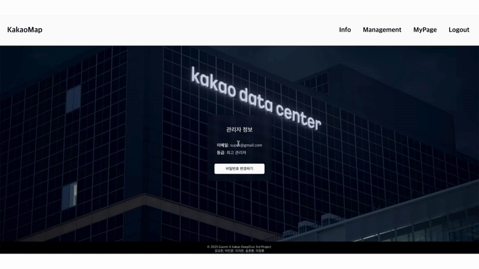

<strong>관리자 권한 변경</strong>

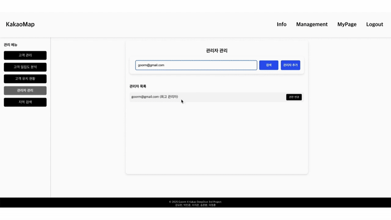

- 관리자  역할(Role)에 따른 권한 설정

<strong>관리자 조회</strong>

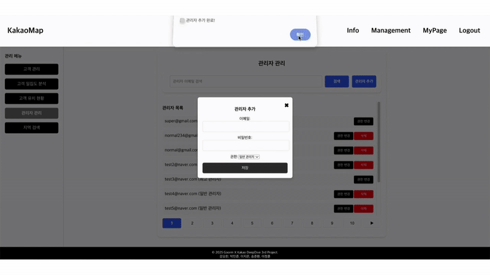

- 특정 이메일을 기준으로 관리자 검색 가능
- 페이징을 적용하여 전체 관리자 목록 조회 가능

<strong>관리자 삭제</strong>

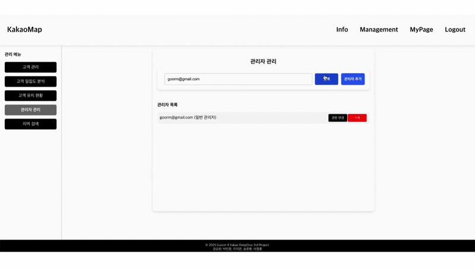

- 특정 관리자를 삭제하는 기능 (SUPER 권한 필요)
- 삭제된 관리자는 더 이상 로그인 불가능

## 유저 관련 기능

<strong>유저 추가</strong>

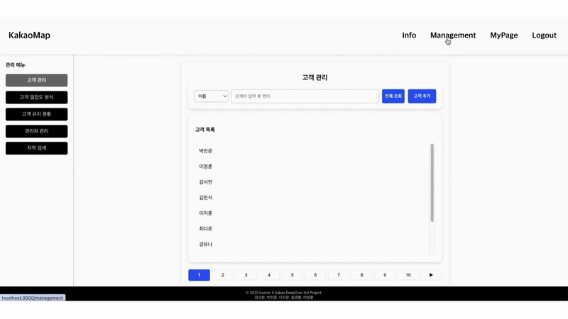

- 사용자가 이메일, 비밀번호, 이름, 연락처, 주소, 성별, 나이를 입력하여 계정 생성

<strong>유저 주소 변경 및 주소 이력 관리</strong>

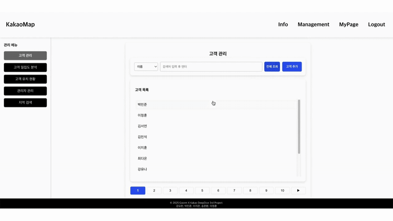

- 유저의 주소가 변경될 경우, 기존 주소를 Address History에 저장
- 새로운 주소를 등록할 때, Kakao API를 이용해 좌표 변환 후 저장
- 유저가 거쳐간 주소 이력을 조회 가능

<strong>유저 검색 및 조회</strong>

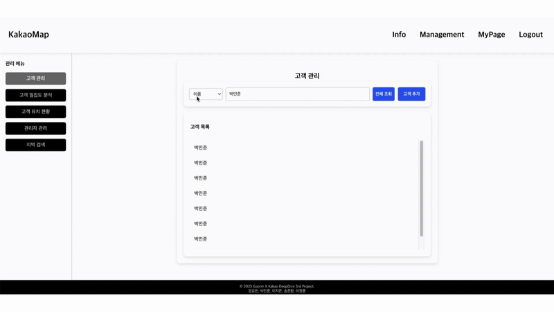

- 특정 유저 ID로 상세 조회 가능
- 페이징을 적용하여 전체 유저 목록을 조회 가능
- 이름, 도로명 주소, 지번 주소를 기준으로 유저 검색 가능

<strong>유저 히트맵 조회</strong>

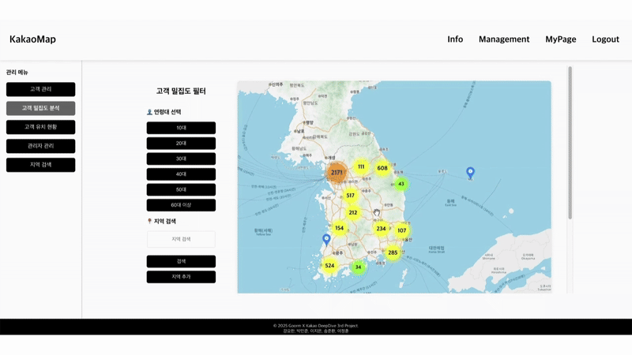

- 유저 위치 기반 히트맵 데이터를 분석 가능

<strong>유저 통계 조회</strong>

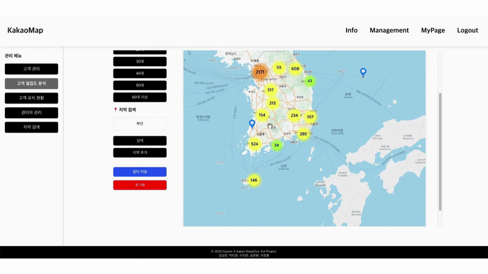

- 특정 지역, 성별, 연령대를 기준으로 사용자 통계를 조회 가능

